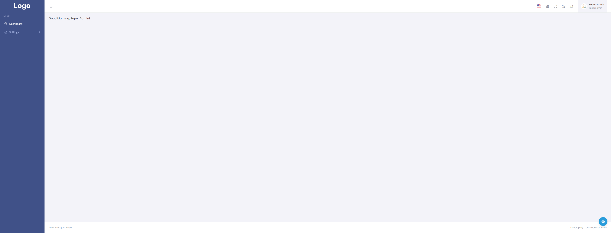
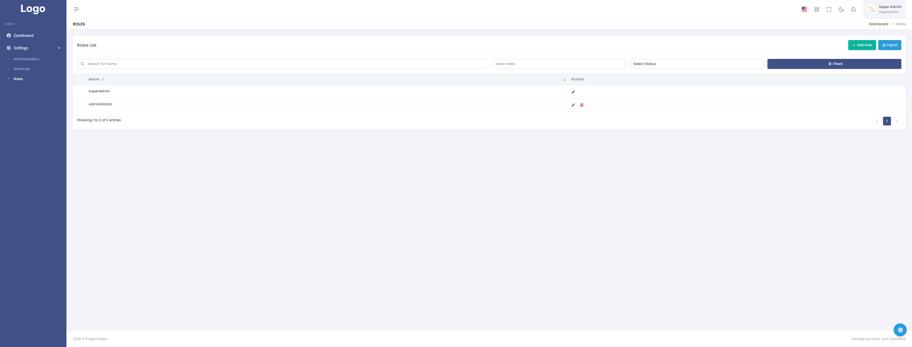
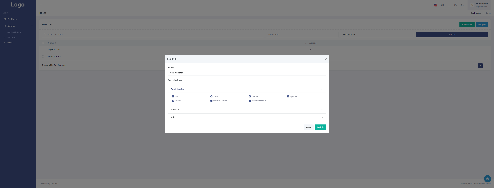
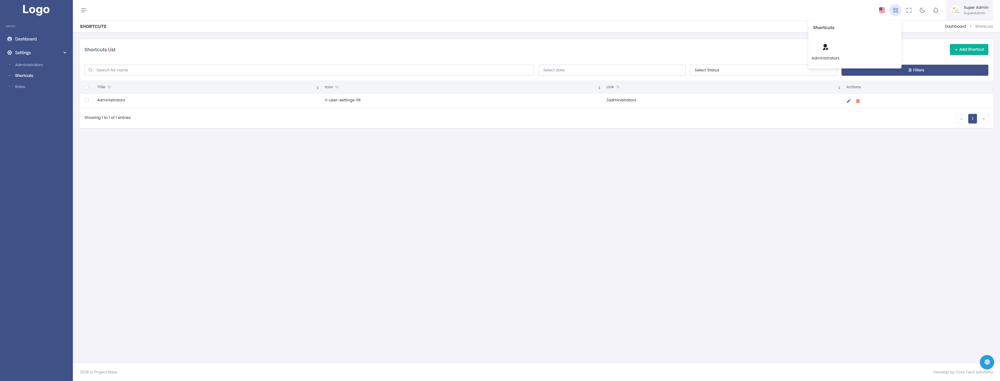
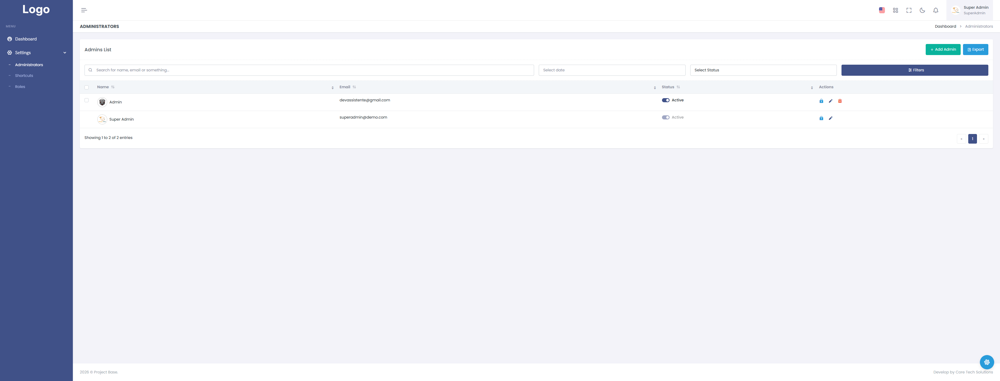

# Angular 19 - Project Base Dashboard Template

Este é um projeto de frontend profissional e reativo desenvolvido em **Angular 19** integrado ao ecossistema **NgRx** para gerenciamento de estado global. O projeto utiliza o template **Velzon** como base visual, adaptado para operar com uma arquitetura moderna baseada inteiramente em **Standalone Components** e injeção de dependência via função `inject()`.

Ele foi desenhado para se integrar nativamente com a Web API em **.NET 10**, fornecendo controle de acessos dinâmico e carregamento fluido de dados.

---

## 📸 Screenshots do Sistema

Aqui estão algumas das principais telas do ecossistema em funcionamento:

### 1. Telas auth Reativas
> Integração com o fluxo de autenticação JWT, tratamento automático de erros de credenciais e gravação síncrona de tokens.


### 2. Dashboard Principal & Sidebar Dinâmica
> Renderização baseada no perfil e nas claims retornadas em tempo real pelo backend .NET 10.
 

### 3. Controle de Permissões e Roles (Ações de Tela)
> Exemplo prático de botões (Criar, Editar, Deletar) aparecendo e sumindo do DOM de acordo com os privilégios do usuário logado.

> 


### 4. Controle de Shortcuts (Ações de Tela)
> Exemplo prático de botões (Criar, Editar, Deletar) aparecendo e sumindo do DOM de acordo com os privilégios do usuário logado.


### 4. Controle de Admins (Ações de Tela)
> Exemplo prático de botões (Criar, Editar, Deletar) aparecendo e sumindo do DOM de acordo com os privilégios do usuário logado.


---

## 🚀 Principais Recursos & Implementações

* **Angular 19 Native:** Uso estrito de componentes autônomos (Standalone Components) e ciclo de vida otimizado.
* **NgRx State Management:** Gerenciamento reativo e centralizado para Autenticação, Roles e Permissões de Usuário (`Store`, `Actions`, `Effects`, `Selectors`).
* **Segurança Reativa (`*appHasPermission`):** Diretiva estrutural inteligente que ouve o estado do NgRx e remove elementos fisicamente do DOM se o usuário não possuir a claim necessária (ex: `Create_Role`, `Delete_Role`).
* **Interceptação HTTP Síncrona (`JwtInterceptor`):** Captura o token em tempo real do `sessionStorage` a cada requisição, eliminando problemas de concorrência e o erro 401 durante a troca rápida de usuários.
* **Controle de Erros Robusto (`ErrorInterceptor`):** Captura respostas `401 Unauthorized` da API de forma pacífica, limpando a sessão e redirecionando o usuário ao login sem quebrar a renderização ou causar loops infinitos de recarregamento.

---

## 🛠️ Configuração Inicial

### Pré-requisitos
* [Node.js](https://nodejs.org/) (Versão 18 ou superior recomendada)
* [Angular CLI](https://angular.dev/tools/cli) instalado globalmente:
```bash
npm install -g @angular/cli

## Development server

Run `ng serve` for a dev server. Navigate to `http://localhost:4200/`. The app will automatically reload if you change any of the source files.

## Code scaffolding

Run `ng generate component component-name` to generate a new component. You can also use `ng generate directive|pipe|service|class|guard|interface|enum|module`.

## Build

Run `ng build` to build the project. The build artifacts will be stored in the `dist/` directory.

## Running unit tests

Run `ng test` to execute the unit tests via [Karma](https://karma-runner.github.io).

## Running end-to-end tests

Run `ng e2e` to execute the end-to-end tests via a platform of your choice. To use this command, you need to first add a package that implements end-to-end testing capabilities.

## Further help

To get more help on the Angular CLI use `ng help` or go check out the [Angular CLI Overview and Command Reference](https://angular.io/cli) page.
